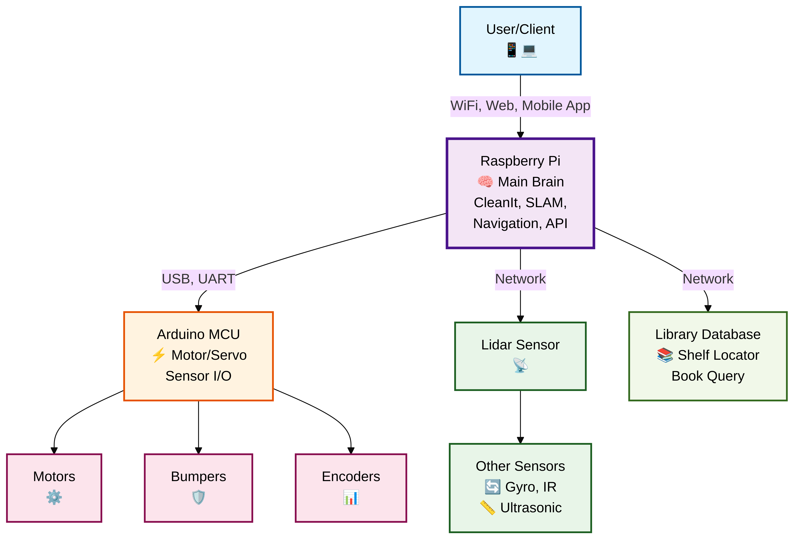

# BLR: An Intelligent Library Book Finder

## System Architecture:

### Communication Flow
- **User/Client** interacts with the robot via network (WiFi, app, web interface).
- **Raspberry Pi** runs the main software (CleanIt), processes commands, maps, and queries the library database.
- **Raspberry Pi ↔ Arduino:** Serial (USB/UART) communication for low-level motor and sensor control.
- **Lidar Sensor** connects to the Raspberry Pi, feeds real-time scan data for SLAM and navigation.
- **Arduino** controls motors, servos, and reads basic sensors (encoders, bumpers); relays data to Pi.
- **Library Database** provides mapping from book queries to shelf locations.
- **Other Sensors** (gyroscope, ultrasonic, IR) provide additional data to Raspberry Pi for localization and navigation.

### Key Data Flow
- **User → Pi:** Command/query (e.g., find book)
- **Pi → Database:** Shelf lookup
- **Pi → Lidar/Sensors:** Get environmental data
- **Pi → Arduino:** Send motor/sensor commands
- **Arduino → Pi:** Report sensor/encoder readings
- **Pi → User:** Response/navigation path
